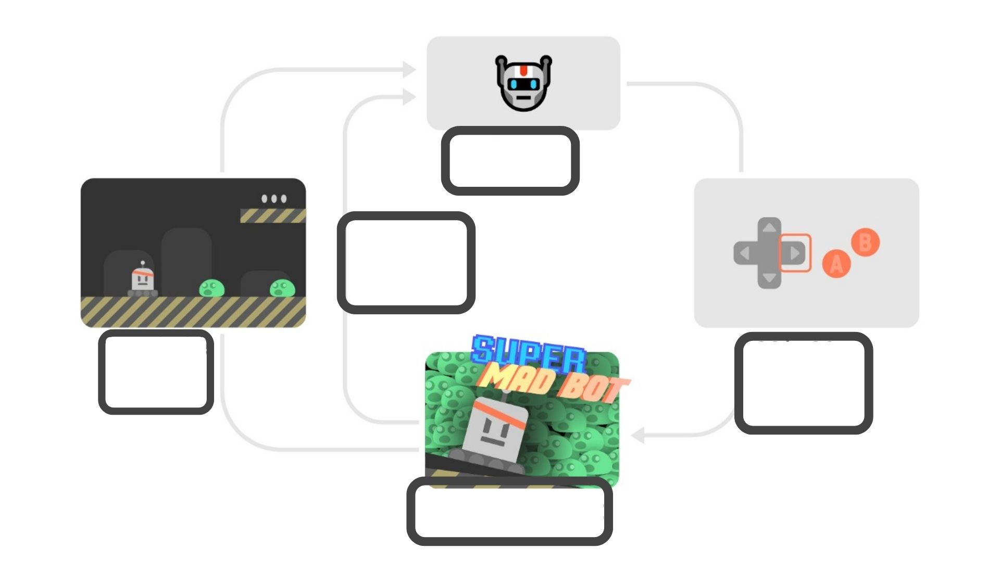
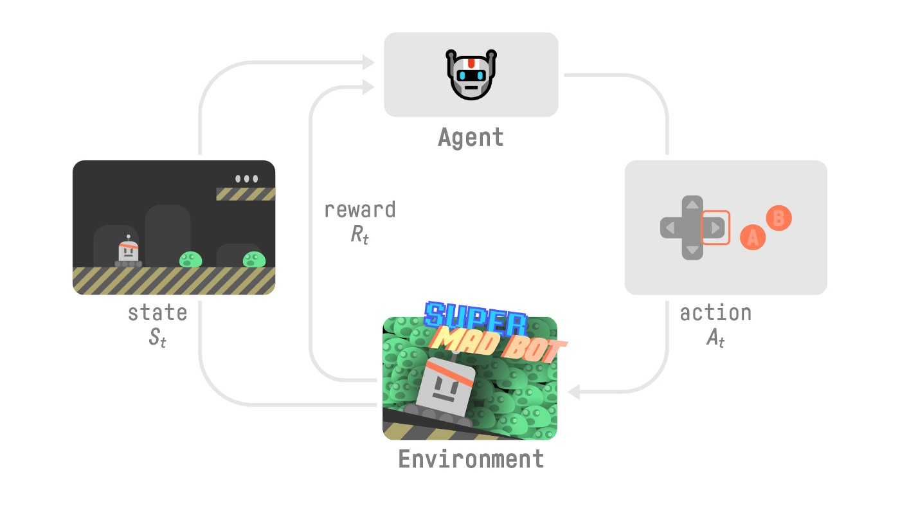

# 知识回顾 ✔️

[避免能力错觉](https://fr.coursera.org/lecture/learning-how-to-learn/illusions-of-competence-BuFzf)的最好方式**是自我测验**. 这将帮助你找到**你需要巩固的地方.**

📝 拿出一张纸试着写出答案, **然后进行订正**.

### 第1题: 什么是强化学习?

  
答案

  强化学习是一个解决控制任务(也叫做决策问题)的框架, 通过构建智能体来从环境中学习; 智能体通过重复试验与环境进行交互获得奖罚(奖励或者惩罚)作为独特的反馈.

  📖 如果你忘记了, 请查看 👉 https://huggingface.co/blog/deep-rl-intro#a-formal-definition

### 第2题: 定义强化学习循环

  每一步:
  - 我们的智能体从环境中接收 ____
  - 基于____智能体执行____
  - 我们的智能体将右移动
  - 环境将变成____
  - 环境将反馈给智能体____

  
答案

  

  每一步:
  - 我们的智能体从环境中接收**状态s0**
  - 基于**状态s0**智能体执行**动作a0**
  - 我们的智能体将右移动
  - 环境将变成**新状态s1**
  - 环境将反馈给智能体**奖励r1**

  📖 如果你忘记了, 请查看 👉 https://huggingface.co/blog/deep-rl-intro#the-rl-process
    

