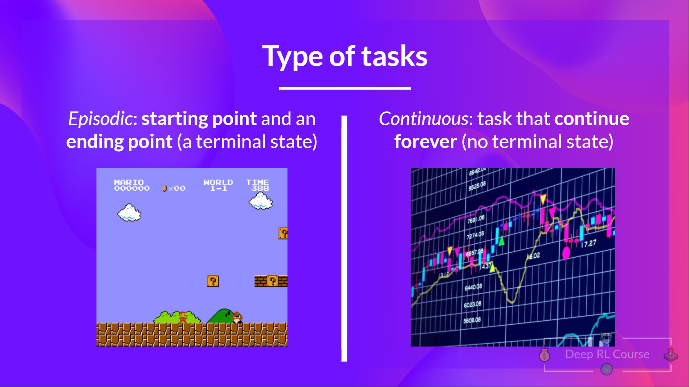
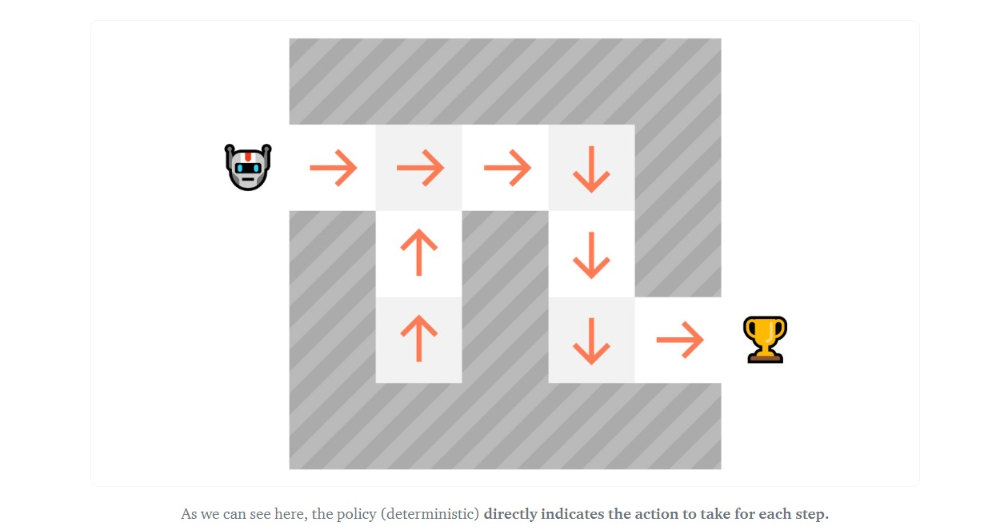
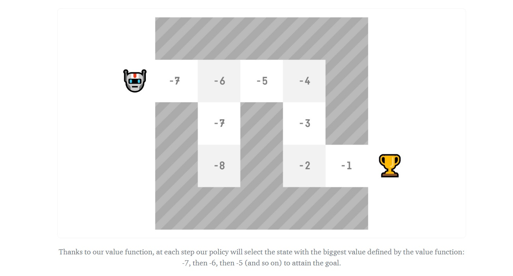

# 知识回顾 ✔️

[避免能力错觉](https://fr.coursera.org/lecture/learning-how-to-learn/illusions-of-competence-BuFzf)的最好方式**是自我测验**. 这将帮助你找到**你需要巩固的地方.**

📝 拿出一张纸试着写出答案, **然后进行订正**.

### 第1题: 什么是强化学习?

  
答案

  强化学习是一个**解决控制任务(也叫做决策问题)的框架**, 通过构建智能体来从环境中学习; 智能体通过重复试验与环境进行交互**获得奖罚(奖励或者惩罚)作为独特的反馈**.

  📖 如果你忘记了, 请查看 👉 https://huggingface.co/blog/deep-rl-intro#a-formal-definition

### 第2题: 定义强化学习循环

  在每一步:
  - 我们的智能体从环境接收____
  - 基于____, 智能体采取____
  - 我们的智能体将向右移动
  - 从环境中产生____
  - 环境将反馈给智能体____

  
答案

  

  在每一步:
  - 我们的智能体从环境接收**状态S0**
  - 基于**状态S0**, 智能体采取**行动A0**
  - 我们的智能体将向右移动
  - 从环境中产生**新状态S1**
  - 环境将反馈给智能体**奖罚R1**

  📖 如果你忘记了, 请查看 👉 https://huggingface.co/blog/deep-rl-intro#the-rl-process

### 第3题: 环境状态和可观察的环境状态之间有什么区别?

  
答案

  - 状态是在完全可观察的环境中**对世界状态的完整描述**(没有隐藏信息). 例如, 在国际象棋中, 我们从环境接收一个状态, 我们可以访问整个棋盘的全部信息.
  - 可观察的状态是在部分可观察的环境中**对世界状态的部分描述**. 例如, 在《超级马里奥兄弟》中, 我们只能看到靠近玩家的关卡的一部分, 所以我们接收一个可观察的状态.

  

  📖 如果你忘记了, 请查看 👉 https://huggingface.co/blog/deep-rl-intro#observationsstates-space

### 第4题: 强化学习问题的两种类型的任务是什么?

  
答案

  - 情节任务(Episodic task): 我们有**一个起点和一个终点(一个终止状态)**. 这将创建一个情节: 状态, 行动, 奖罚和新状态的序列. 例如, 想想《超级马里奥兄弟》: 一局从新马里奥关卡开始, 直到你被杀或者你到达关卡终点结束.
  - 连续任务(Continuous task): 这些任务是**永远持续下去的(没有终止状态)**. 在这种情况下, 智能体必需学习如何选择最好的行动并同时与环境交互.

  

  📖 如果你忘记了, 请查看 👉 https://huggingface.co/blog/deep-rl-intro#type-of-tasks

### 第5题: 什么是探索/经验平衡?

  
答案

  在强化学习中, 我们需要**平衡我们如何去探索环境, 如何利用我们对已知环境的经验**.

  - 探索是通过**尝试随机动作**探索环境, **来找到更多关于环境的信息**.
  - 经验是**利用已知信息获得最大奖励**.

  

  📖 如果你忘记了, 请查看 👉 https://huggingface.co/blog/deep-rl-intro#exploration-exploitation-tradeoff

### 第6题: 什么是策略?

  
答案

  - 策略 $\pi$ 是**智能体的大脑**, 它是一个告诉我们在给定状态采取什么动作的函数. 所以它定义了智能体在给定时间的行为.

  

  📖 如果你忘记了, 请查看 👉 https://huggingface.co/blog/deep-rl-intro#the-policy-%CF%80-the-agents-brain

### 第7题: 什么是基于价值的方法?

  
答案

  - 基于价值的方法是解决强化学习问题的主要方法之一.
  - 在基于价值的方法中, 我们不是训练一个策略函数, 而是**训练一个将状态映射到处于该状态的期望值的价值函数.**

  

  📖 如果你忘记了, 请查看 👉 https://huggingface.co/blog/deep-rl-intro#value-based-methods

### 第8题: 什么是基于策略的方法?

  
答案

  - 在基于策略的方法中, 我们直接学习**一个策略函数**.
  - 策略函数将**映射每一个状态到该状态的最佳对应动作. 或者在该状态下的一组可能的动作的概率分布.**

  

  📖 如果你忘记了, 请查看 👉 https://huggingface.co/blog/deep-rl-intro#policy-based-methods

---

恭喜你**完成了测验** 🥳, 如果你忘记了一些信息, 请花一些时间[再次阅读本章](https://huggingface.co/blog/deep-rl-intro)来巩固(😏)你的知识.

**不断学习, 不断精彩**

