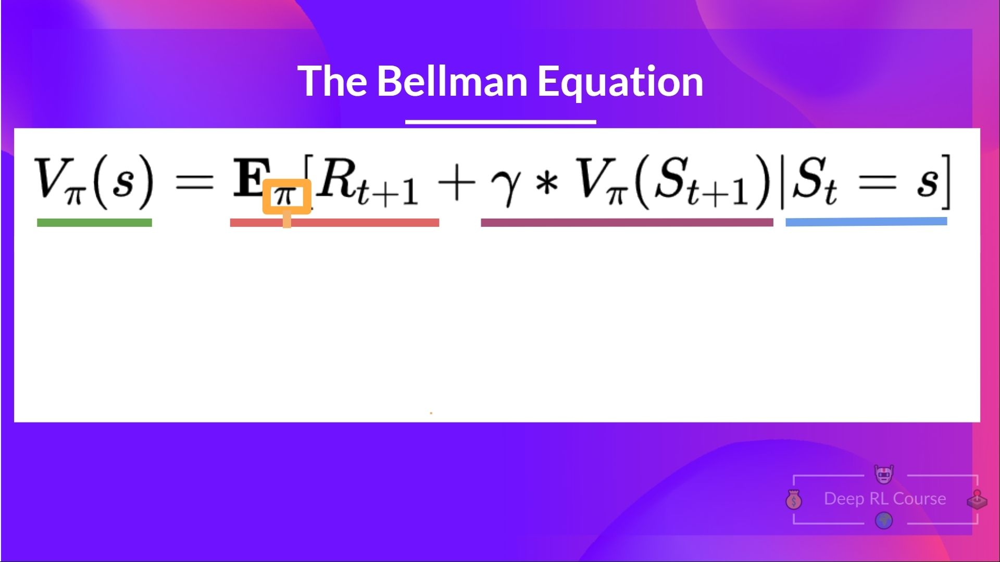
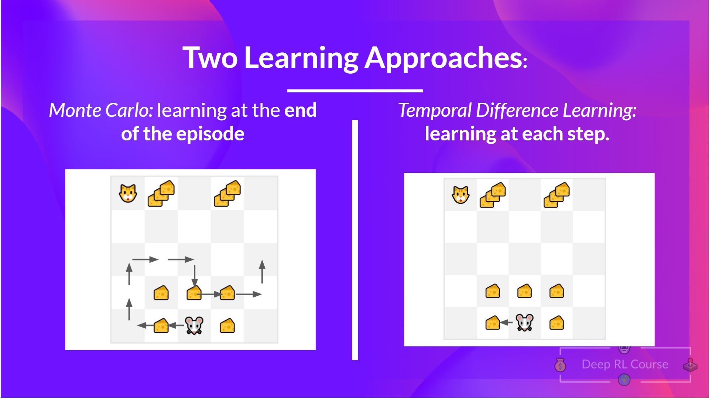
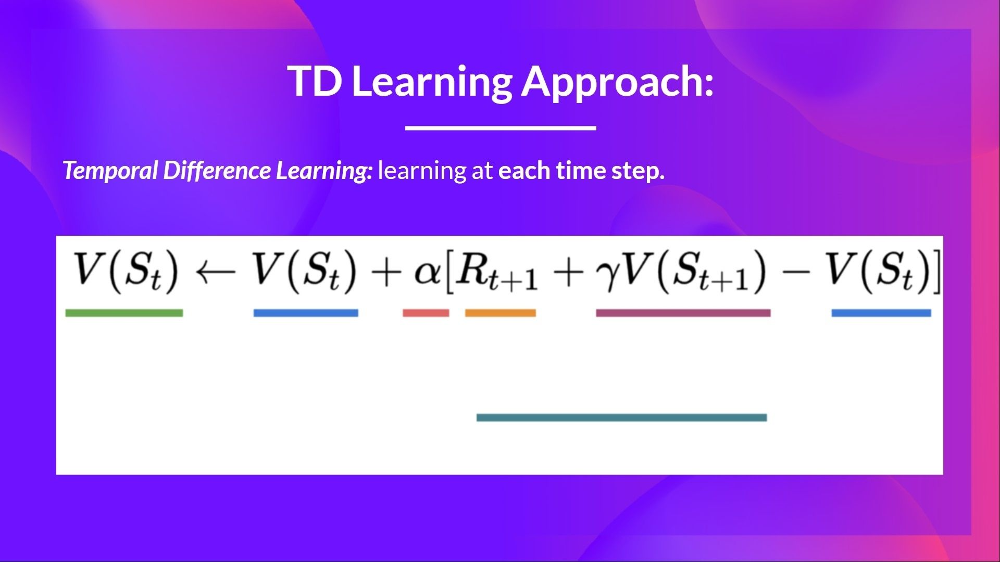
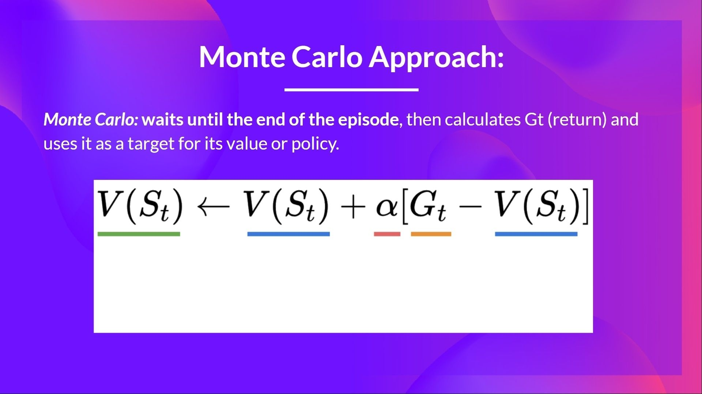
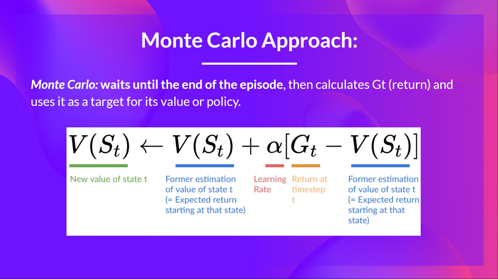

# 知识回顾 ✔️

[避免能力错觉](https://fr.coursera.org/lecture/learning-how-to-learn/illusions-of-competence-BuFzf)的最好方式**是自我测验**. 这将帮助你找到**你需要巩固的地方.**

📝 拿出一张纸试着写出答案, **然后进行订正**.

### 第1题: 找到最优策略的两种主要方法是什么?

  
答案

  两种主要方法是:

  * 基于策略的方法: **直接训练策略**来学习给定状态采取的动作.
  * 基于价值的方法: 训练一个价值函数来**学习哪个状态更有价值, 并使用这个价值函数来采取导致它的行动**.

  

  📖 如果你忘记了, 请查看 👉 https://huggingface.co/blog/deep-rl-q-part1#what-is-rl-a-short-recap

### 第2题: 什么是贝尔曼方程?

  
答案

  **贝尔曼方程是一个递归方程**, 它的工作原理是: 不是从每个开始状态计算回报, 而是我们将任何状态的值视为:
$$
  R_{t+1} + (\gamma * V(S_{t+1}))
$$
  即时奖罚+下一个状态的加权价值函数.

📖 如果你忘记了, 请查看 👉 https://huggingface.co/blog/deep-rl-q-part1#the-bellman-equation-simplify-our-value-estimation

### 第3题: 定义贝尔曼方程的每一部分

  
答案

  📖 如果你忘记了, 请查看 👉 https://huggingface.co/blog/deep-rl-q-part1#the-bellman-equation-simplify-our-value-estimation

### 第4题: 蒙特卡洛和时序差分方法的有什么区别?

  
答案

  学习策略或者价值函数有两种方法:

  * 使用蒙特卡洛方法, 我们**从一个完整的周期**更新价值函数, 因此我们使用这个周期实际准确的加权回报.
  * 使用时序差分方法, 我们**从每一步**更新价值函数, **因此我们将我们没有的回报Gt替换为TD目标值的估计回报**.

  

  📖 如果你忘记了, 请查看 👉 https://huggingface.co/blog/deep-rl-q-part1#monte-carlo-vs-temporal-difference-learning

### 第5题: 定义时序差分学习公式的每一部分

  
答案

  

  📖 如果你忘记了, 请查看 👉 https://huggingface.co/blog/deep-rl-q-part1#temporal-difference-learning-learning-at-each-step

### 第6题: 定义蒙特卡洛学习公式的每一部分

  
答案

  

  📖 如果你忘记了, 请查看 👉 https://huggingface.co/blog/deep-rl-q-part1#monte-carlo-learning-at-the-end-of-the-episode

---

恭喜你**完成了测验** 🥳, 如果你忘记了一些信息, 请花一些时间[再次阅读本章](https://huggingface.co/blog/deep-rl-q-part1)来巩固(😏)你的知识.

**不断学习, 不断精彩**

