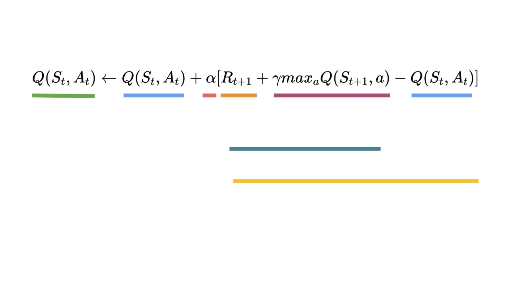
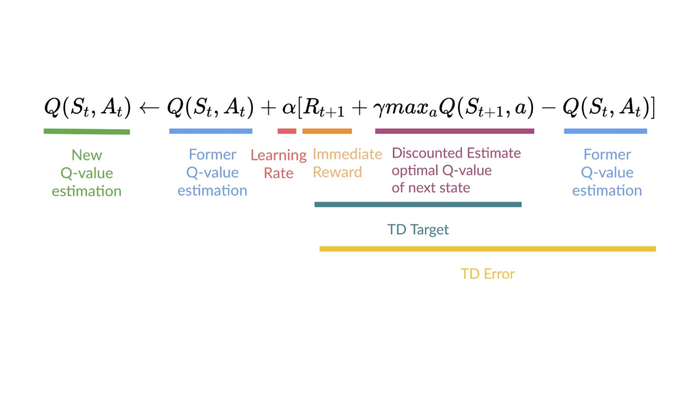

# 知识回顾 ✔️

[避免能力错觉](https://fr.coursera.org/lecture/learning-how-to-learn/illusions-of-competence-BuFzf)的最好方式**是自我测验**. 这将帮助你找到**你需要巩固的地方.**

📝 拿出一张纸试着写出答案, **然后进行订正**.

### 第1题: 什么是Q-Learning?

  
答案

  Q-Learning是**一种我们用来训练我们的Q-函数的算法**, Q-函数是动作-价值函数, 它确定处于特定状态并在该状态下采取特定动作的价值.

  📖 如果你忘记了, 请查看 👉 https://huggingface.co/blog/deep-rl-q-part2#what-is-q-learning

### 第2题: 什么是一个Q-表?

  
答案

  Q-表是我们的智能体的"内部存储", 它的每个单元格对应一个状态-动作对. 将Q-表视为Q-函数的存储或者备忘录.

  📖 如果你忘记了, 请查看 👉 https://huggingface.co/blog/deep-rl-q-part2#what-is-q-learning

### 第3题: 为什么如果我们有了最优Q-函数 Q*, 则我们就拥有最优策略?

  
答案

  因为如果我们有一个最优Q-函数, 我们就知道每个状态下采取什么动作是最优的, 所以我们有最优策略.

  

  📖 如果你忘记了, 请查看 👉 https://huggingface.co/blog/deep-rl-q-part2#what-is-q-learning

### 第4题: 你能解释什么是epsilon-greedy策略吗?

  
答案

  epsilon-greedy策略是**一种处理平衡探索/经验的策略**.

  思路是我们定义epsilon $\epsilon = 1.0$ : 

  * 当概率为$1 - \epsilon$: 我们使用经验(也就是我们的智能体选择一个最高的状态-动作对值的动作).
  * 当概率为$\epsilon$: 我们进行探索(尝试随机动作).

  

  📖 如果你忘记了, 请查看 👉 https://huggingface.co/blog/deep-rl-q-part2#the-q-learning-algorithm

### 第5题: 我们如何更新状态-动作对的Q值?

  
答案

  

  📖 如果你忘记了, 请查看 👉 https://huggingface.co/blog/deep-rl-q-part2#the-q-learning-algorithm

### 第6题: on-policy算法和off-policy算法有什么区别?

  
答案

  

  📖 如果你忘记了, 请查看 👉 https://huggingface.co/blog/deep-rl-q-part2#off-policy-vs-on-policy

---

恭喜你**完成了测验** 🥳, 如果你忘记了一些信息, 请花一些时间[再次阅读本章](https://huggingface.co/blog/deep-rl-q-part2)来巩固(😏)你的知识.

**不断学习, 不断精彩**

