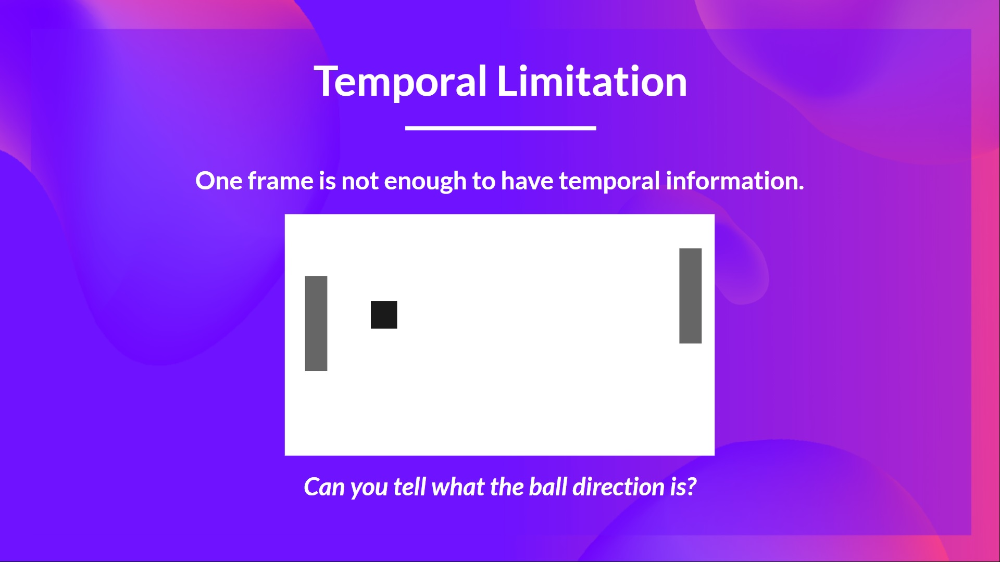

# 知识回顾 ✔️

[避免能力错觉](https://fr.coursera.org/lecture/learning-how-to-learn/illusions-of-competence-BuFzf)的最好方式**是自我测验**. 这将帮助你找到**你需要巩固的地方.**

📝 拿出一张纸试着写出答案, **然后进行订正**.

### 第1题: 什么是表格方法?

  
答案

  *表格方法*是一种问题类型, 其中的状态和动作空间足够小, 近似价值函数**可用数组和表格表示**. 例如,  **Q-Learning是一种表格方法**因为我们使用表格表示状态-动作价值对.

  📖 如果你忘记了, 请查看 👉 https://huggingface.co/blog/deep-rl-dqn#from-q-learning-to-deep-q-learning

### 第2题: 为什么我们不能使用经典Q-Learning来解决一个雅达利的游戏?

  
答案

  雅达利环境有一个形状为(210, 160, 3)的可观察的空间, 取值范围从0到255, 因此我们得到256^(210x160x3) = 256^100800(**便于比较, 在可观测的宇宙中大约有10^80个原子**).
  因此, 状态空间是巨大的; 于是, 为这个环境创建和更新一个Q-表**效率不高**. 在这种情况下, 最好的办法是使用参数化Q-函数 $Q_{\theta}(s,a)$ 来近似Q-值而不是使用Q-表.
  📖 如果你忘记了, 请查看 👉 https://huggingface.co/blog/deep-rl-dqn#from-q-learning-to-deep-q-learning

### 第3题: 当我们使用视频帧作为深度Q-Learning的输入时, 为什么我们将四帧堆叠在一起?

  
答案

  我们堆叠视频帧在一起, 因为它帮助我们**处理了时间限制的问题**. 由于一帧画面不足以捕获时间信息. 例如, 在游戏乒乓中, 我们的智能体**如果只获得一帧画面将不能知道球的方向**.

  
  

  📖 如果你忘记了, 请查看 👉 https://huggingface.co/blog/deep-rl-dqn#preprocessing-the-input-and-temporal-limitation

### 第4题: 深度Q-Learning的两个阶段是什么?

  
答案

  深度Q-Learning训练算法有两个阶段:

  - *采样*: 我们执行动作并**将观察到的经验元组存储到回放内存中**.
  - *训练*: 随机选择一小批次元组, 然后**使用梯度下降更新, 从中学习**.

  📖 如果你忘记了, 请查看 👉 https://huggingface.co/blog/deep-rl-dqn#preprocessing-the-input-and-temporal-limitation

### 第5题: 为什么我们在深度Q-Learning中创建回放内存?

  
答案

  1. **更高效地使用训练期间的经验**

     通常, 在线强化学习中, 我们与环境进行交互, 获得经验(状态, 动作, 奖罚和新状态), 然后从中学习(更新神经网络)并丢弃它们. 但是通过经验回放, **我们创建一个回放缓冲区来保存在训练期间可重用的经验样本**.

  2. **避免忘记之前的经验并减少经验之间的相关性**

     如果我们提供序列化的经验样本, 我们会遇到的问题是我们的神经网络它**趋向于忘记之前的经验**, 因为它会覆盖新的经验. 例如, 如果我们先玩第一关然后第二关, 关卡是不同的, 我们的智能体会忘记在第一关如何表现和行动.

  📖 如果你忘记了, 请查看 👉 https://huggingface.co/blog/deep-rl-dqn#experience-replay-to-make-more-efficient-use-of-experiences

### 第6题: 我们如何使用双重深度Q-Learning?

  
答案

  当我们计算Q-目标时, 我们使用两个神经网络将动作选择与目标Q值生成解耦. 我们:

  * 使用我们的*DQN网络*去**选择下一个状态的最佳动作**(具有最高的Q值的动作).
  * 使用我们的*目标网络*去**计算在下一个状态采取动作的目标Q值**.

---

恭喜你**完成了测验** 🥳, 如果你忘记了一些信息, 请花一些时间[再次阅读本章](https://huggingface.co/blog/deep-rl-dqn)来巩固(😏)你的知识.

**不断学习, 不断精彩**

